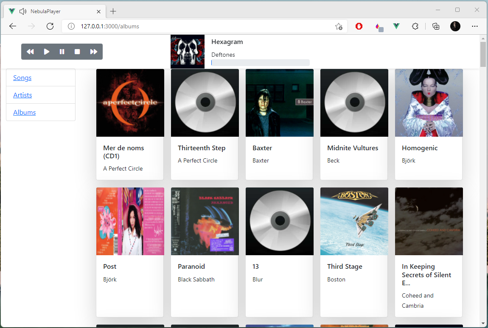

# NebulaPlayer

A personal music player written in Python and VueJS. NebulaPlayer isn't a practical project - it is unlikely that anyone needs it - it was written as a learning exercize to improve the author's Python skills as well as to get up to speed on what's new in the world of Vue. However, if it is of use to anyone that is wonderful.

## Requirements
- Python 3.10 or higher
- NodeJS 8 or higher
- npm
- pip
- pipenv

## Installation
1. Clone the code
2. Install Python dependencies:
```bash
$ pipenv install
```
3. Install the Vue depdencies
```bash
$ cd musicplayer-frontend ; npm install
```

## Configuration and Setup
The `lib/config.py` file contains the `CONFIG` dict which defines the configuration for the backend server instances. Change the `LibraryDirectory` value to the path of your music library. You can change what files player attempts to scan for via the `SupportedFiles` array.

After you've configured the server run the scanner:
```bash
$ pipenv scan
```
The scanner will index all of your music files on disc as well as grabbing additional metadata from online sources.

## Execution
NebulaPlayer requires both front end and back end servers to be run. As this is a learning and hobby project I only have directions on how to run the app with dev not-for-production-use servers. To run with a real webserver like nginx or apache you'd need to do additional config.

#### Back End
```bash
$ pipenv run server
```
#### Front End
```bash
$ pipenv run frontend
```

Open `http://127.0.0.1:5000` in a browser and enjoy a round-about and complicated way to play your music!